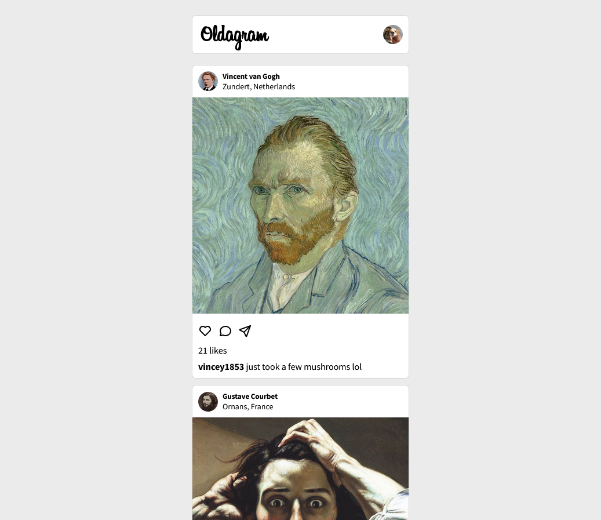
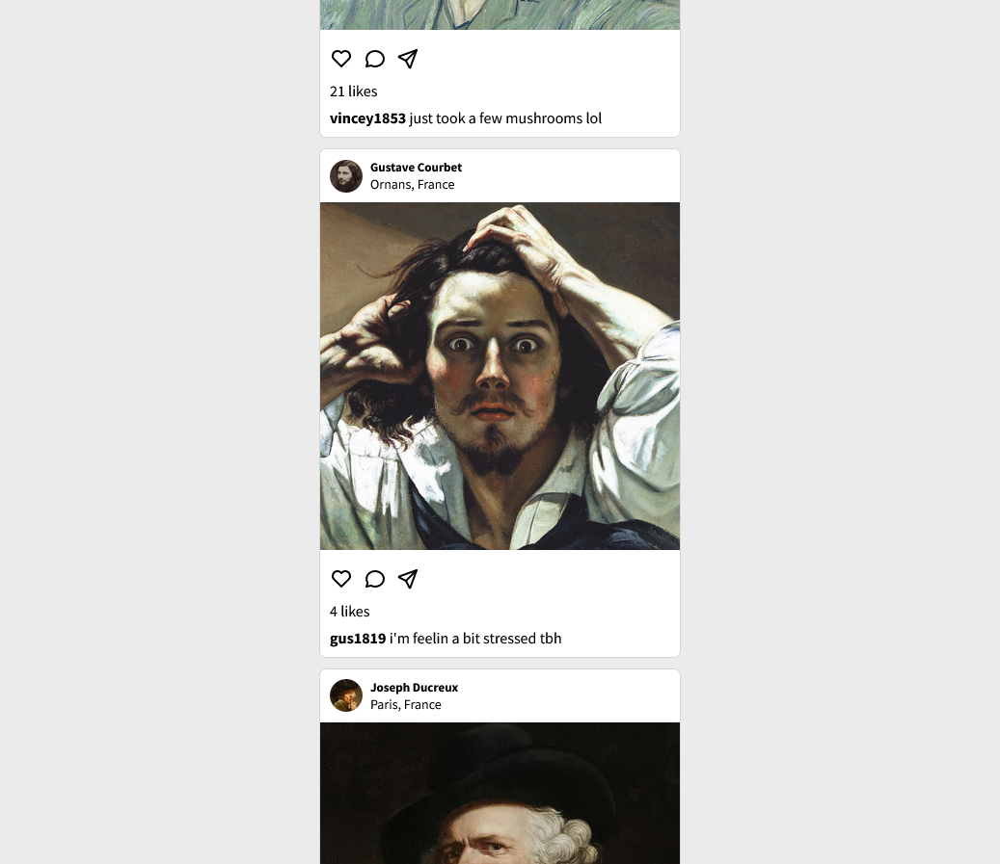
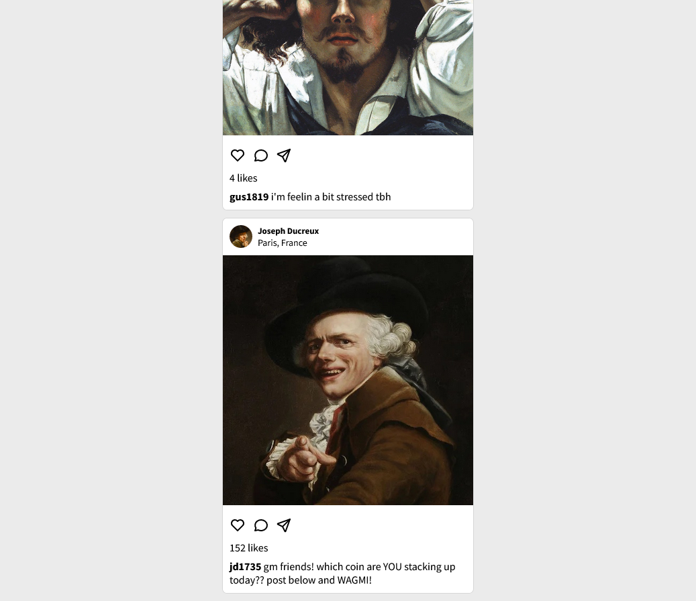

# Oldagram remake

Simple instagram feed clone (remake of [this](https://github.com/FelixHPerez/oldagram) repo). This new repo uses vite and react instead.

## Live demo

[Netlify](https://flx-oldagram.netlify.app/)

## Screenshots

  
  
  

## Built with

- Vite
- React
